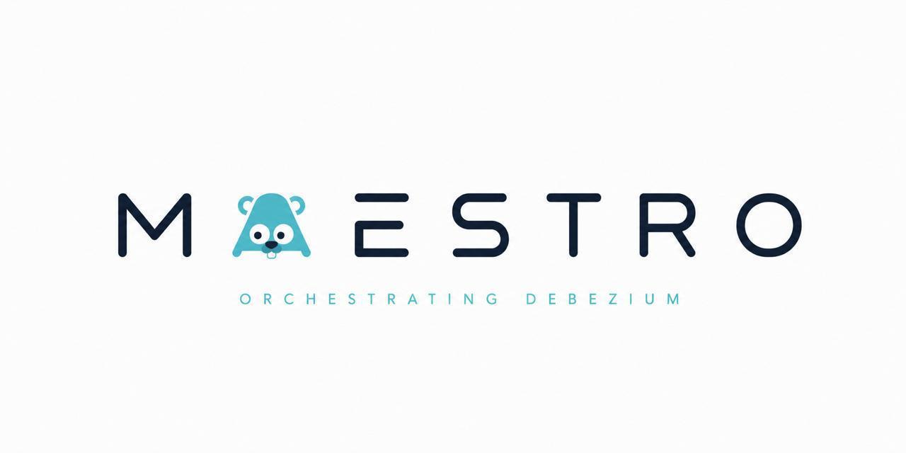

<p align="center">
  
</p>

# Maestro

Maestro is a control plane for Debezium CDC connectors running on Kafka Connect.
It wraps the Kafka Connect REST API with an authenticated backend, a web console,
pre-deploy database checks, config validation, audit history, and a full
Prometheus / Grafana observability stack — so you never have to touch
`curl localhost:8083` again.

## Features

- **Connector lifecycle** — create, update, delete, pause / resume and hot-restart
  connectors and individual tasks, including isolated restart of failed tasks.
- **Rebalance-aware Kafka Connect client** — HTTP client with timeouts and
  automatic retries with exponential backoff and jitter, built to survive
  Kafka Connect cluster rebalances.
- **Pre-deploy PostgreSQL checks (`dbcheck`)** — before a connector starts,
  Maestro verifies connectivity, PostgreSQL version compatibility, logical
  replication readiness, user privileges, free replication slots and WAL senders,
  publication correctness, and captured tables (existence, `SELECT` access,
  primary key or `REPLICA IDENTITY`, CDC readability). Verdicts come as an
  `ok / warning / error` report with fix recommendations.
- **Schema-based config validation** — Debezium / Kafka Connect configs are
  validated by type, required params and recommended values, with support for
  custom properties.
- **Audit log** — every config change stores JSONB before/after snapshots with
  full change history.
- **Users & RBAC** — JWT access/refresh auth, admin/user roles.
- **Observability as code** — RED metrics on an internal `:9100` listener,
  Kafka Connect metrics via JMX Exporter, 6 Prometheus alerts with Slack
  delivery, and a provisioned Grafana dashboard (`Maestro RED`).
- **Web console** — React + Vite UI in the style of Debezium UI: dashboard with
  live statuses, connector list with task drill-down, schema-driven config
  editor, audit and users pages.

## Architecture

```
                    ┌─────────────┐
                    │  Web console │  React + Vite (served by :8080)
                    └──────┬──────┘
                           │ JWT
                    ┌──────▼──────┐      ┌──────────────┐
                    │ Maestro API │─────▶│ Kafka Connect│──▶ Kafka ──▶ Debezium ──▶ Postgres
                    │   :8080     │      │    :8083     │
                    └──────┬──────┘      └──────┬───────┘
                           │                    │ JMX :8084
                    ┌──────▼──────┐      ┌──────▼───────┐
                    │  Postgres   │      │  Prometheus  │──▶ Grafana :3000
                    │ (app + CDC) │      │    :9090     │──▶ Alertmanager :9093 ──▶ Slack
                    └─────────────┘      └──────────────┘
```

Scrape targets: `maestro:9100` (app RED metrics), `connect:8084` (JMX),
plus Prometheus self-scrape and Alertmanager.

## Quick start

Prerequisites: Go 1.25+, Docker with Compose v2, Node 20+ (only for web dev).

```bash
# 1. Configure environment
cp .env.example .env
# fill in POSTGRES_*, JWT_SECRET, MIDDLEWARE_ALLOWED_ORIGINS, ...

# 2. Alertmanager Slack secret (needs ALERTMANAGER_SLACK_API_URL in .env)
make alertmanager-config

# 3. Start the whole stack
make docker-up

# 4. Apply DB migrations
make migrate-up
```

| Service      | URL                      |
|--------------|--------------------------|
| API / Web UI | http://127.0.0.1:8080    |
| Grafana      | http://127.0.0.1:3000    |
| Prometheus   | http://127.0.0.1:9090    |
| Alertmanager | http://127.0.0.1:9093    |
| Kafka Connect| http://127.0.0.1:8083    |

API contract: [`api/swagger.yaml`](api/swagger.yaml) (OpenAPI, `vacuum`-linted).

## Configuration

All settings come from the environment (see [`.env.example`](.env.example),
`kelseyhightower/envconfig` under the hood):

| Prefix            | Purpose                                  |
|-------------------|------------------------------------------|
| `POSTGRES_*`      | app database + CDC source checks         |
| `JWT_*`, `AUTH_*` | auth, sessions, cookie                   |
| `SERVER_*`        | public HTTP server (`:8080`)             |
| `METRICS_*`       | internal metrics listener (`:9100`)      |
| `KAFKA_CONNECT_*` | Connect base URL, timeouts, retry policy |

## Observability

- **Metrics** — `http_server_requests_total`, `http_server_request_duration_seconds`,
  `maestro_connector_info/tasks` on the internal listener (never exposed publicly).
- **Alerts** — [`deploy/prometheus/alert.rules.yml`](deploy/prometheus/alert.rules.yml):
  Debezium lag / disconnect, Connect down, Maestro down, 5xx rate, failed connectors.
- **Dashboards** — [`deploy/grafana/`](deploy/grafana/): datasource + `Maestro RED`
  dashboard are provisioned from git on Grafana startup (datasource, RED, P95,
  connector/task states, Debezium lag). No clicking in the UI — edit JSON, restart.

## Development

```bash
make build             # go build -o bin/maestro ./cmd/maestro
make run               # build + run
make test              # unit tests, -race -cover
make test-integration  # testcontainers suites (needs Docker)
make lint              # golangci-lint
make mocks             # regenerate mockery mocks
make validate-swagger  # vacuum lint api/swagger.yaml
make lint-dockerfile   # hadolint via compose
make lint-trivy        # Trivy HIGH/CRITICAL scan
```

Conventions: table-driven tests with full comparisons, `goleak` in suites,
parallel tests where possible; integration tests live in `test/integration`
(.overlay network via testcontainers, real PostgreSQL); conventional commits.

## Project structure

```
cmd/maestro            entrypoint, Dockerfile
internal/core          shared kernel: domain, metrics, logger, security, transport
internal/features      vertical slices: auth, users, connectors, audit
  <slice>/{domain,service,repository,transport}
migrations             golang-migrate SQL versions
deploy                 prometheus / alertmanager / grafana / jmx-exporter as code
docs                   swagger.yaml (OpenAPI contract)
test/integration       testcontainers suites (pgxadapter, users, auth, audit, dbcheck)
web                    React + Vite console (maestro-web)
```
