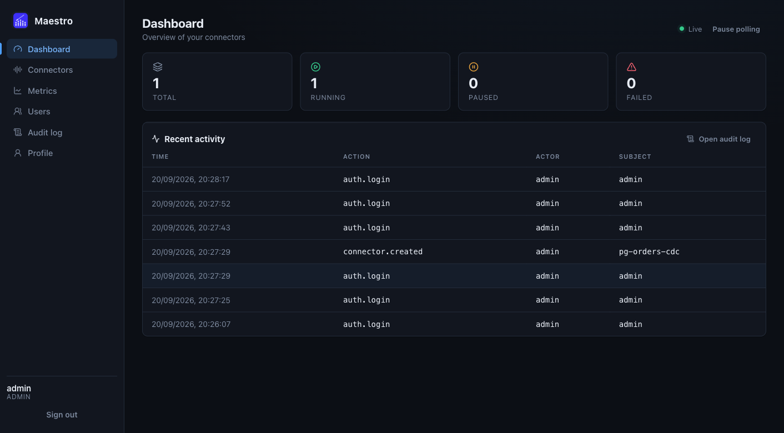
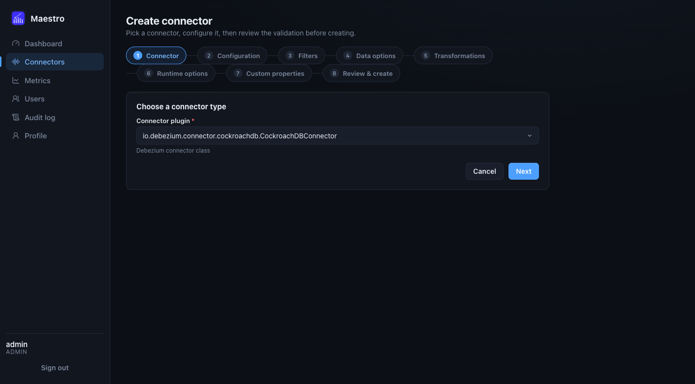
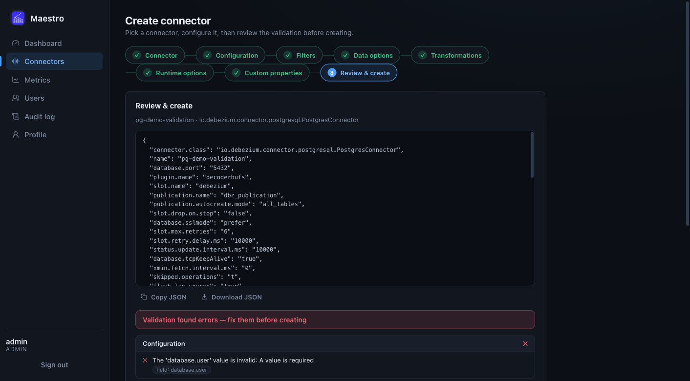
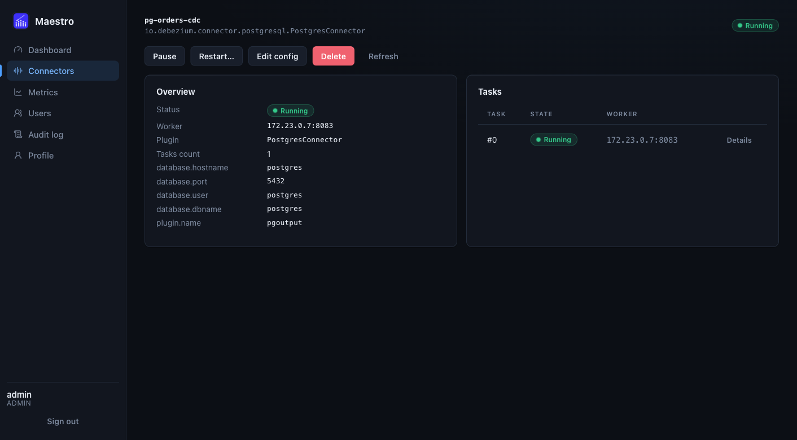
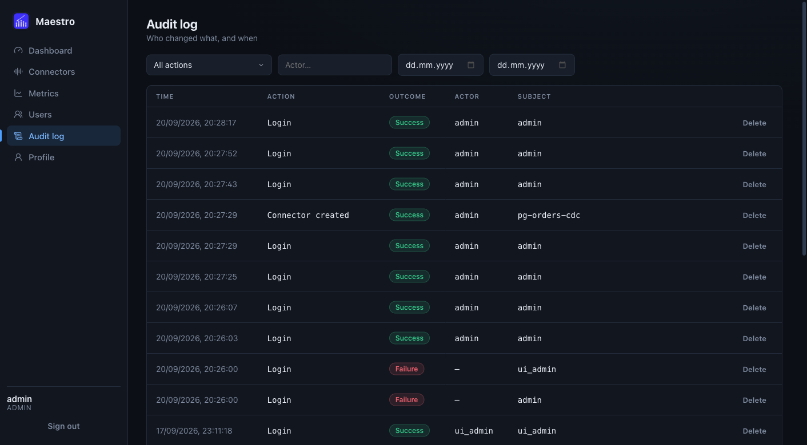
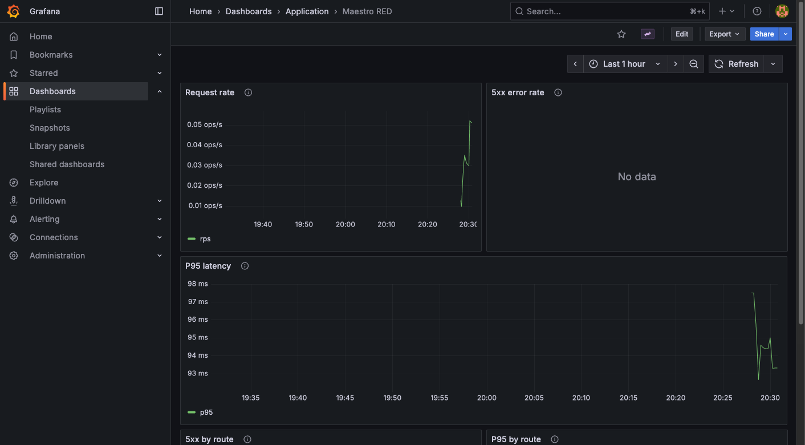

<p align="center">
  
</p>

# Maestro

[](https://go.dev)
[](LICENSE)
[](https://github.com/daniildddd/maestro/actions/workflows/test.yml)
[](https://github.com/daniildddd/maestro/actions/workflows/lint.yml)

Maestro is a control plane for Debezium CDC connectors running on Kafka Connect.
It wraps the Kafka Connect REST API with an authenticated backend, a web console,
pre-deploy database checks, config validation, audit history, and a full
Prometheus / Grafana observability stack — so you never have to touch
`curl localhost:8083` again.

> **TL;DR:** `cp .env.example .env && make alertmanager-config && make docker-up && make migrate-up` →
> open `http://127.0.0.1:8080`, validate a Postgres config, create a connector,
> watch rows flow into Kafka. Full walkthrough in [Demo](docs/demo.md).

## Contents

- [What is Maestro?](#what-is-maestro)
- [Features](#features)
- [Quick start](#quick-start)
- [Screenshots](#screenshots)
- [Compatibility](#compatibility)
- [Documentation](#documentation)
- [Contributing](CONTRIBUTING.md)
- [License](#license)

## What is Maestro?

Running Debezium in production usually means juggling three things at once:
Kafka Connect REST (`:8083`), Postgres-side prerequisites (`wal_level`,
publications, `REPLICA IDENTITY`, privileges, slots), and the question
"who changed this connector config and when?".

Maestro puts a single authenticated surface in front of all three:

- **For developers:** a web wizard to create a connector from a live plugin
  schema, with validation before deploy.
- **For operators:** pause / resume / restart (including failed-tasks-only),
  audit log with before/after snapshots, Prometheus alerts + Grafana.
- **For the database:** a pre-deploy `dbcheck` that fails fast with a fix hint
  instead of a dead connector at 3 AM.

Non-goals: Maestro is not a replacement for Kafka Connect or Debezium, not a
schema registry, and not a data pipeline orchestrator. It manages connector
lifecycle — Debezium still does the CDC.

## Features

- **Connector lifecycle** — create, update, delete, pause / resume and hot-restart
  connectors and individual tasks, including isolated restart of failed tasks.
- **Rebalance-aware Kafka Connect client** — HTTP client with timeouts and
  automatic retries with exponential backoff and jitter, built to survive
  Kafka Connect cluster rebalances.
- **Pre-deploy PostgreSQL checks (`dbcheck`)** — before a connector starts,
  Maestro verifies connectivity, PostgreSQL version compatibility, logical
  replication readiness, user privileges, free replication slots and WAL senders,
  publication correctness, and captured tables (existence, `SELECT` access,
  primary key or `REPLICA IDENTITY`, CDC readability). Verdicts come as an
  `ok / warning / error` report with fix recommendations.
- **Schema-based config validation** — Debezium / Kafka Connect configs are
  validated by type, required params and recommended values, with support for
  custom properties.
- **Audit log** — every config change stores JSONB before/after snapshots with
  full change history.
- **Users & RBAC** — JWT access/refresh auth, admin/user roles.
- **Observability as code** — RED metrics on an internal `:9100` listener,
  Kafka Connect metrics via JMX Exporter, 6 Prometheus alerts with Slack
  delivery, and a provisioned Grafana dashboard (`Maestro RED`).
- **Web console** — React + Vite UI in the style of Debezium UI: dashboard with
  live statuses, connector list with task drill-down, schema-driven config
  editor, audit and users pages.

Service map, request flow and project structure: [`docs/architecture.md`](docs/architecture.md).

## Quick start

Prerequisites: Go 1.26+, Docker with Compose v2, Node 20+ (only for web dev).

```bash
# 1. Configure environment
cp .env.example .env

# 2. JMX exporter jar (gitignored, required for the `connect` service)
make jmx-exporter

# 3. Alertmanager Slack secret (needs ALERTMANAGER_SLACK_API_URL in .env;
#    skip if you only want local metrics without Slack delivery)
make alertmanager-config

# 4. Start the whole stack
make docker-up

# 5. Apply DB migrations
make migrate-up
```

| Service      | URL                      | Credentials (defaults) |
|--------------|--------------------------|------------------------|
| API / Web UI | http://127.0.0.1:8080    | create first user, see [Demo](docs/demo.md) |
| Grafana      | http://127.0.0.1:3000    | `GF_SECURITY_ADMIN_USER` / `GF_SECURITY_ADMIN_PASSWORD` (default `admin`/`admin`) |

Only Maestro and Grafana publish host ports — Grafana because the Metrics page
embeds it via iframe in your browser. Postgres, Kafka, Connect, Prometheus and
Alertmanager live inside the compose network only.

Next: [Demo](docs/demo.md) — first admin user, then Postgres → Kafka end to end.

## Screenshots

> Screenshots live in `docs/assets/` and are embedded here so the repo page
> works as a product landing. Captured from a live stack
> (`make docker-up`, Postgres 17 + Debezium 3.5.2): dashboard with one running
> connector, the 8-step create wizard, a validation report showing a failing
> `dbcheck` with fix hints, connector detail with task drill-down, audit log,
> and the provisioned `Maestro RED` Grafana dashboard.

| Dashboard (live statuses) | Create wizard (schema-driven) | Validation report (dbcheck) |
|---------------------------|-------------------------------|-----------------------------|
|  |  |  |

| Connector detail (tasks) | Audit log                                 | Grafana (Maestro RED) |
|--------------------------|-------------------------------------------|-----------------------|
|  |  |  |

To refresh them: `make docker-up && make migrate-up`, create the admin user
(see [Demo](docs/demo.md)), run the demo scenario, and re-capture the pages above.

## Compatibility

Pinned in [`docker-compose.yml`](docker-compose.yml) — CDC stacks break silently
on version drift, so check this table before changing images. `dbcheck`
additionally verifies the live database at connector deploy time.

| Component     | Version                |
|---------------|------------------------|
| Go            | 1.26                   |
| Kafka Connect | Debezium 3.5.2         |
| Apache Kafka  | 4.3.1                  |
| PostgreSQL    | 17 (`wal_level=logical`) |
| Prometheus    | 3.5.0                  |
| Alertmanager  | 0.28.1                 |
| Grafana       | 12.2                   |
| Node (web)    | 20+                    |

## Documentation

- [Architecture](docs/architecture.md) — service map, request flow, project structure
- [Demo](docs/demo.md) — first admin user + Postgres → Kafka end to end
- [Configuration](docs/configuration.md) — environment variables and settings
- [Development](docs/development.md) — Make targets, conventions, CI
- [Monitoring](docs/monitoring.md) — metrics, alerts, Grafana dashboards
- [API reference](api/swagger.yaml) — OpenAPI contract (live spec, `vacuum`-linted)

## Contributing

See [CONTRIBUTING.md](CONTRIBUTING.md).

## License

MIT — see [LICENSE](LICENSE).
